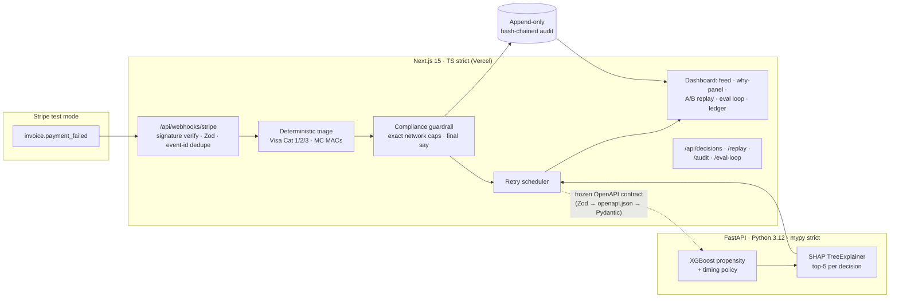

# HackGuard — judge-facing pitch

**Track:** AI Revenue Recovery · **Live:** https://hackathon-getyourfit.vercel.app · **Repo quality gate:** `npm run verify` (TS strict + mypy strict, 131+ tests), `scripts/verify-e2e.sh` (golden path, recorded in `docs/VERIFICATION.md`).

---

## Problem

- Failed subscription payments cost the industry **>$129B in 2025**; ~13% of subscription billing attempts fail (Recurly press research, https://recurly.com/press/failed-payments-could-cost-subscription-companies-more-than-129-billion-in-2025-us/).
- Retry intelligence is paywalled: incumbents charge **$250–700+/mo** — out of reach for $5k–$50k MRR SaaS.
- Blind retrying is now *fined*: Visa Category-1 declines must never be retried; >15 reattempts/30 days draws per-attempt fees. Mastercard TPE caps 10/24h, 35/30d ($0.15/attempt over 35). Most small businesses have zero triage.

## Solution (one sentence)

HackGuard is a free, self-hostable decision layer above Stripe's built-in retries: deterministic decline triage (RETRY / NEVER-RETRY / ASK-CUSTOMER), model-scored retry timing, network-rule compliance guardrails with rule citations on every decision, and a hash-chained audit ledger that proves it — no LLM anywhere in a consequential decision path.

## Live-demo cue points (full script: `DEMO.md`)

| Cue | Beat | What judges see (verified live) |
|---|---|---|
| 0:40 | Signed Stripe webhook ingest | New decision row appears within one 4s poll; rule citation `VISA-CAT23-MAX15-PER-30D` on the row |
| 1:15 | Why-panel | Action badge, P(recover), scheduled retry, rule citations, model version |
| 1:30 | Red-team beat | "Retry blocked by compliance engine — would violate `VISA-CAT1-NEVER-RETRY`" + new audit row |
| 1:45 | A/B replay | $98.00 baseline vs **$390.00** policy on the identical 12-failure stream; verbatim counterfactual caption |
| 1:55 | Eval loop | `policy-v6: recovery 27.4% → 39.3%, violations 0` vs baseline 35.7% **with $993.40 penalty-fee exposure** |
| 2:25 | Verify chain | "Chain intact — N entries verified, no tampering detected." |

## Architecture in one slide

Contracts are generated, never hand-synced (`packages/contracts` → `openapi.json` → `contracts_gen.py`; a pytest enforces sync). Errors are typed unions; every boundary is validated.

## Business model

1. **Open-core (free, forever):** the decision brain — triage, guardrails, scheduler, ledger — self-hostable in one command (`docker compose up --build`). This is the distribution wedge and the trust story: merchants can audit the rules that spend their money.
2. **Hosted ($49/mo, undercuts the $250+ floor):** multi-instance durability (Postgres/Redis already wired via `DATABASE_URL`/Upstash), keep-alive, email dunning.
3. **Audit pack ($199/yr):** exportable hash-chained compliance ledger + rule-citation reports for finance/auditor review — the ledger is already built; the upsell is formatting and attestation it satisfies network-programm requirements.

Why it holds: the compliance ledger and SHAP explanations are the expensive-to-build parts and they're already in the free core — the paid tiers sell *operations and attestation*, not features gated out of the core.

## Why only now

- **Network rules turned retries into a fines game (2022→):** Visa's excessive-reattempts RAF and Mastercard's TPE made "just retry 4 times" actively expensive — triage went from nice-to-have to mandatory.
- **The data became public:** matured, fully-repaid lending cohorts (Lending Club 2007–2011) plus published recovery-by-attempt curves make a *honest* propensity model trainable by a two-person team — no proprietary data hoard required.
- **Free-tier cloud matured:** Vercel + Neon + Render make the $0-COGS open-core distribution economically real for the first time.

## Honest limitations (we show this slide on purpose)

1. **Cloud demo runs the scheduler in disclosed degraded mode:** the XGBoost/SHAP sidecar isn't attached to the Hobby deployment, so retry timing uses the published-curve fallback and the audit ledger honestly records actor `RULE` instead of `MODEL` (see the `degraded` flag on every response). Locally, `uv run uvicorn scoring.main:app` restores full SHAP.
2. **Transfer learning, disclosed:** the propensity model trains on Lending Club loan outcomes, not card-retry outcomes (provenance + SHA-256 pin in `docs/DATA.md`; methodology and alternatives in `docs/MODEL.md`). Timing priors come from published industry curves; the A/B replay is labeled **counterfactual estimation** in contract-enforced UI text — never presented as observed fact.
3. **In-memory stores per serverless instance on the Hobby URL** — set `DATABASE_URL` (Neon) for durability; the code path is identical.
4. **Stripe-only at demo** (architecture allows more PSPs); test-mode only, no real charges ever.
5. **Propensity AUC is 0.63, not 0.9** — that's the honest held-out number vs a 0.5 constant and ~0.57 best single-rule baseline (`models/registry/propensity-v1.0.0/eval_report.md`); the compliance layer, not model heroics, is where the first dollars come from.

Judges reward teams that know where their product ends. Ours: the model is the seasoning; deterministic triage + enforced network caps + tamper-evident proof are the meal.
